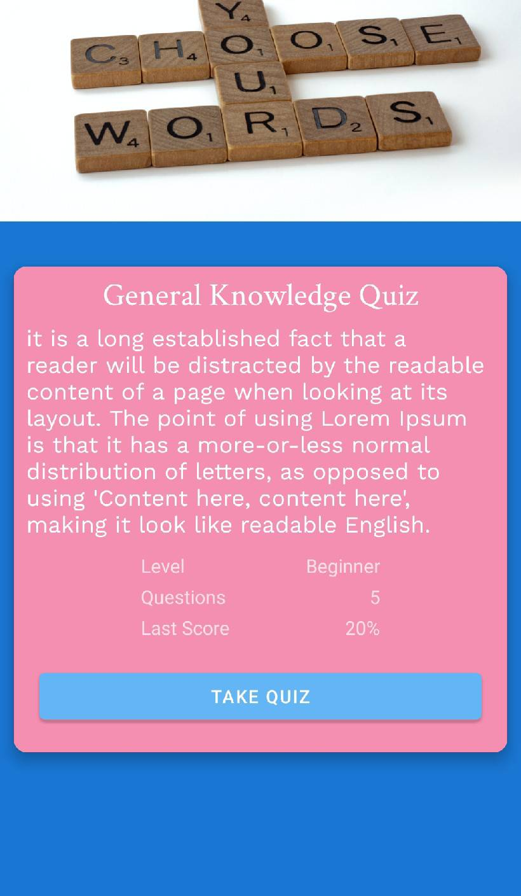
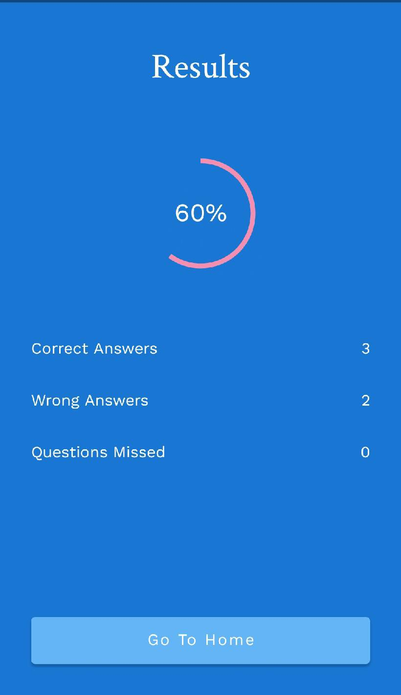

# QuizApp_Firebase_MVVM

Quiz App built  with Android Jetpack Components (Navigation - MVVM) and Firebase Auth - Firestore
Youtube tutorial: https://www.youtube.com/playlist?list=PLKETiCsEsH0rU9mP3oXmfq5u9_wTpjMLH

# Homepage, with progressbar

# RecyclerView, Displaying List of Quizes

# Detail of quiz. 

# Quiz Fragment. 

# Result Fragment. 

